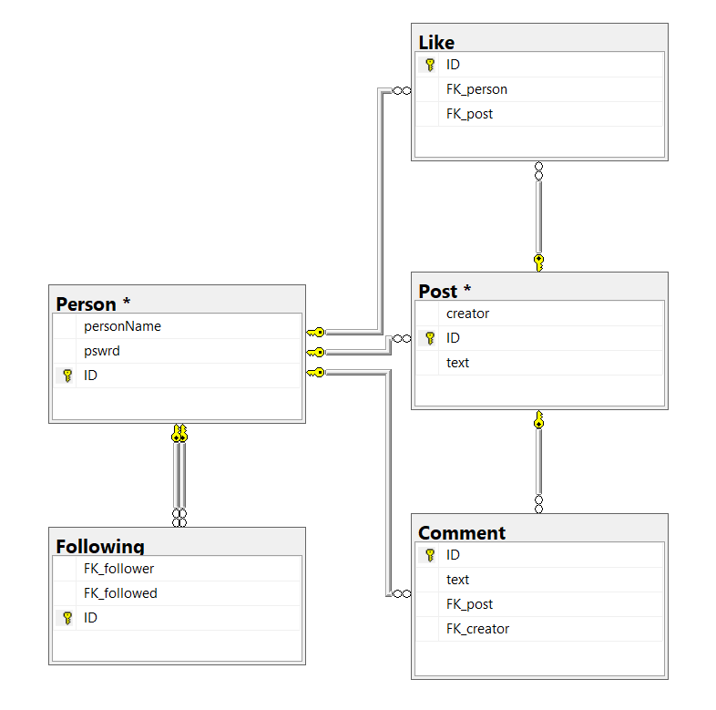

# ToothTsoha
Tietokantasovellus, harjoitustyö syksy 2019

### [Sovellus Herokussa](https://tsohafoorumi.herokuapp.com/)
Sovellukseen käyttäjä: username: asd password: asd

Tässä pikku huomio, toteutin materiaalissa esiintyviä asioita, joten kirjautuminen ja käyttäjän luominen on nyt toteutettu (ilman bcryptiä sillä se heitti jotain outoa erroria johon en löytänyt fixiä) kantataulut käyttäjän ja postin välillä myös toteutettu, ja ulkonäköä hieman kohennettu. 

## Foorumi

Eli ajatus on rakentaa "keskustelupalsta/foorumi" jossa olisi seuraavat päätoiminnallisuudet:

[Käyttötapaukset](documentation/UserStories.md)

## Toteutus

Projekti toteutetaan web sovelluksena, palvelin puoli Pythonia, ja selainpuoli HTML + CSS/Bootstrap

## Alustava Tietokantakaavio

