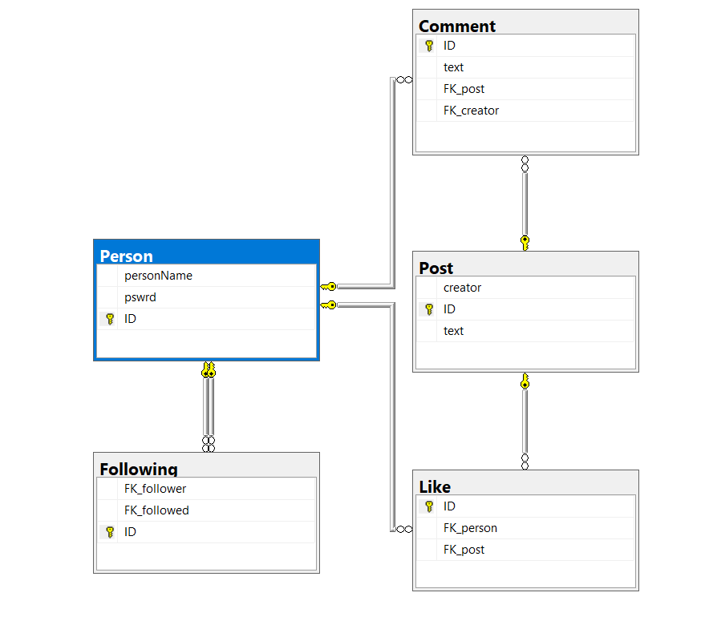

# ToothTsoha
Tietokantasovellus, harjoitustyö syksy 2019

### [Sovellus Herokussa](https://tsohafoorumi.herokuapp.com/)

## Foorumi

Eli ajatus on rakentaa "keskustelupalsta/foorumi" jossa olisi seuraavat päätoiminnallisuudet:

* käyttäjä voi luoda tilin foorumiin, joka luo hänelle oman profiilisivun

* käyttäjä voi kirjautua ja kirjautua ulos tililtään

* käyttäjä voi seurata muita käyttäjiä, ja lopettaa seuraamisen

* käyttäjä voi tehdä yleisiä postauksia, ja poistaa sekä muokata itse tekemiään kirjoituksia

* käyttäjä voi lukea muiden tekemiä postauksia

* käyttäjä voi kommentoida postauksia , ja poistaa tai muokata omia kommenttejaan

* käyttäjä voi lukea muiden tekemiä kommentteja

## Toteutus

Projekti toteutetaan web sovelluksena, palvelin puoli Pythonia, ja selainpuoli HTML + CSS/Bootstrap

## Alustava Tietokantakaavio

