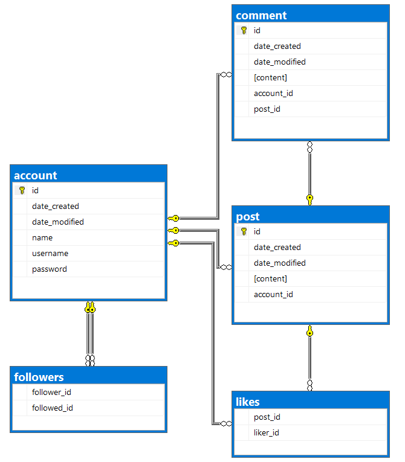

# ToothTsoha
Tietokantasovellus, harjoitustyö syksy 2019

### [Sovellus Herokussa](https://tsohafoorumi.herokuapp.com/)

Sovellukseen esimerkki käyttäijä:

| username | password |
|----------|----------|
| asd      | asd      |  
| dsa      | dsa      | 

## Foorumi

Eli ajatus on rakentaa "keskustelupalsta/foorumi" jossa olisi seuraavat päätoiminnallisuudet:

[Käyttötapaukset](documentation/UserStories.md)

[Käyttöohjeet](documentation/Instructions.md)

## Toteutus

Projekti toteutetaan web sovelluksena, palvelin puoli Pythonia, ja selainpuoli HTML + CSS/Bootstrap

[Create table lausekkeet](documentation/Createtables.md)

## Tietokantakaavio

